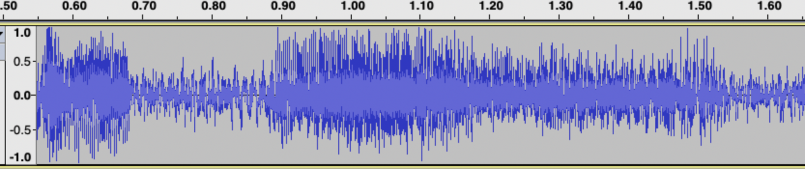
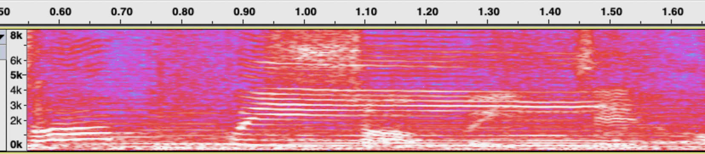
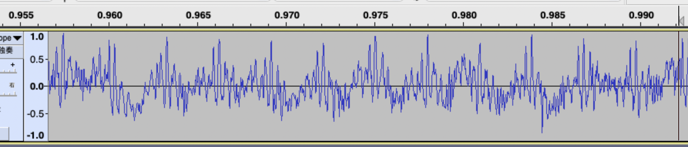
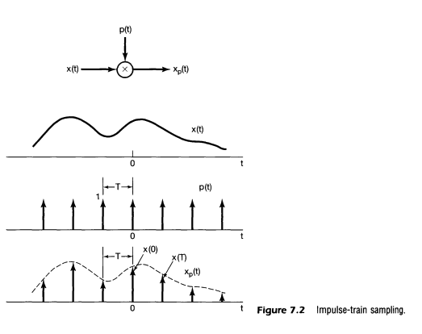
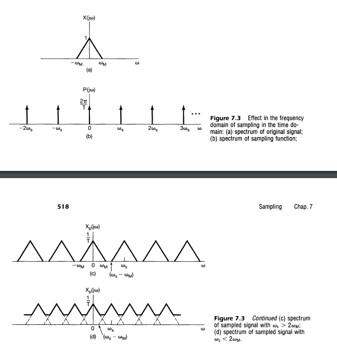

 The Discrete Fourier Transform (DFT) is a form of Fourier Transform suitable for computers. The goal of this repository is to learn how to implement DFT, optimize it step by step. 
 
 Before we start coding, some understand the background knowledge of the Fourier Transform and the Discrete Fourier Transform should be introduced.

# What's the Fourier Transform?

The most direct way to observe and measure signals in the physical world is to record how the signals change over time. This provides us the time-domain signal x(t), which represents the signal‘s amplitude as it changes over time. There are various methods for analyzing signals in the time domain, but certain signal characteristics may not be readily apparent in the time domain. Mathematicians/physicists might convert signals to a specific transform domain for analysis.

For instance, when you document a live performance. Different vocal and instrumental elements, such as bass and soprano singing, along with a variety of musical instruments, can be heard at different pitches. In the time domain, an audio signal looks like a chaotically changing sequence, where you can only see that the volume is sometimes high and sometimes low. How can we distinguish between bass, soprano, and instrumental voices, and identify the songs they are performing?



Sound waves are a type of vibration that is defined by two factors: frequency of vibration and amplitude of vibration. As the frequency of vibration increases, the human ear perceives sharper sounds, while lower frequencies are felt as deeper tones. 

Adult males typically have thicker and wider vocal cords compared to females, resulting in slower vibration and deeper voices for males, and higher voices for females. Various musical instruments resonate at unique frequencies and harmonics. By determining the vibration frequencies present in the music's sound wave signal, we can identify the instruments, singers, and song playing. As show in he image blow, the peaks on the spectrum highlight the specific frequencies of the music being played at that moment.



The Fourier transform is a mathematical tool that converts signals from the time domain (amplitude, time) to the frequency domain (amplitude, frequency) for analysis and processing.

How can this transformation be accomplished? Let's revisit the music signal above and zoom in a certain section. We notice that certain waveforms are repeated, with smaller waveforms overlaid on the larger ones. The time domain sequence that appears to vary randomly is actually not random. It can be broken down into a combination of signals with varying period of time. Frequency decreases as the period lengthens and increases as the period shortens.



Decomposing a time-domain signal into a linear superposition of periodic signals of different frequencies is the fundamental concept behind the Fourier transform.

## Fourier Series (FS)

The Fourier series offers a way to break down a periodic function into a combination of sine and cosine functions. Using the figure presented as a reference, a rectangular wave can be decomposed into a major sine wave which is then combined with multiple smaller sine waves.


*[Fourier transform time and frequency domains (small).gif, CC0, By Lucas Vieira](https://commons.wikimedia.org/w/index.php?curid=28399050)*

The Fourier series utilizes frequency-multiplying trigonometric functions as a set of orthogonal basis, and transforms a periodic signal into coefficients of these orthogonal basis.

Heere is the real number form of the Fourier Series, where $T_0$ is the period in the time domain and $f_0 = 1/T_0$.

$$\begin{aligned}
f(t) & = \frac{a_0}{2}+\sum_{n=0}^{\infty} \left[a_n\cos(2\pi nf_0t)+b_n\sin(2\pi nf_0t)\right] \\
where \\
a_0 & = \frac{1}{T_0}\int_{-T/2}^{T/2} f(t)dt \\
a_n & = \frac{2}{T_0}\int_{-T/2}^{T/2} f(t)\cos(2\pi nf_0t)dt \\
b_n & = \frac{2}{T_0}\int_{-T/2}^{T/2} f(t)\sin(2\pi nf_0t)dt \\
\end{aligned}$$

The complex number form is as follows:

$$\begin{aligned}
X(kf_0) & = \frac{1}{T_0}\int_{T0} x(t) e^{-j2\pi kf_0t}dt \\
x(t) & = \sum_{k=-\infty}^{\infty} X(kf_0)e^{j2\pi kf_0t} 
\end{aligned}$$

## Continuous Time Fourier Transform (CTFT)

Non-periodic signals cannot be directly analyzed using the Fourier Series. However, a non-periodic signal can be seen as a unique periodic function as its period approaches infinity. Under this condition, the Fourier series can be derived as the Fourier integral, and the result is a spectral density function.

$$\begin{aligned}
X(f) & = \lim_{T_0->\infty} \frac{1}{T_0}\int_{T0} x(t) e^{-j2\pi kf_0t}dt 
\end{aligned}$$

The Fourier integral can be used to analyze the spectral density of non-periodic continuous signals, and the spectral density can also be used to restore the time domain signal. This is the continuous-time Fourier transform (CTFT).

$$\begin{aligned}
X(f) & = \int_{t=-\infty}^{\infty} x(t) e^{-j2\pi ft}dt \\
x(t) & = \int_{k=-\infty}^{\infty} X(f)e^{j2\pi ft}df 
\end{aligned}$$

# What is the Discrete Fourier Transform (DFT)?

The CTFT is a useful technique for analyzing continuous signal in the real world. In the digital world, computers rely on binary calculations and have limited memory capacity, meaning that only digitized signals are compatible. Digitized signals refer to signals that are finite, discrete in time, and quantized in vlaue.

The Discrete Fourier Transform (DFT) is designed for the digital world. It is a transform that applies finite and discrte time signals, and generates discrete and finite signals int the frequency domain.

## Discretization in Time: Discrete Time Fourier Transform (DTFT)

First, let's do discretization in the time domain: sampling signals with a period $T_s$. That's equivalent to multiplying the original signal with a impluse train $x(t)\delta(t-nT_s)$.



Apply Fourier transformto the new signal $x(t)\delta(t-nT_s)$:

$$\begin{aligned}
X(f) & = \int_{t=-\infty}^{\infty} x(t)\delta(t-nT_s) e^{-j2\pi ft}dt \\
      & = \sum_{k=-\infty}^{\infty} x(nTs) e^{-j2\pi f(nTs)}
\end{aligned}$$

According to the properties of Fourier transform, multiplying by an impulse train in the time domain is equivalent to convolving the Fourier transform of an impulse string in the frequency domain. The figures in the textbook *Signals and Systems* shows that convoling an impluse train means a periodic extention. The spectrum shifts and repeats with period  $f_s = T_s$.



By sampling in time with period $T_s$, the spectrum is periodic with period $f_s$. The DTFT formula of normalized frequency ($\omega = 2\pi f / f_s$) is as below.

$$\begin{aligned}
X(\omega) & = \sum_{k=-\infty}^{\infty} x[n] e^{-j\omega n} \\
x[n] & = \frac{1}{2\pi}\int_{-\pi}^{\pi} X(\omega)e^{j\omega n} d\omega 
\end{aligned}$$

Since the spetrum is periodically extended, information is useful only in one period (normally $-\pi$ to $\pi$ ). The time-domain signal can be recovered by an inverse transform using spectrum between $-\pi$ and $\pi$. So the integral upper and lower bounds of the inverse DTFT transform are $-\pi$ and $\pi$.

## Discretization in Frequency: Discrete Fourier Transform (DFT)

The DTFT achieves the discretization of time domain. In the same way, we can achieve frequency domain discretization on the DTFT result by sampling the spectrum. 

When we sample the DTFT spectrum every $\omega_k$, series in time periodically extends with period $2\pi/\omega_k$. Thereupon a pair of discrete signals and transformations between them are achieved. That is the Discrete Fourier Transform (DFT).

$$\begin{aligned}
DFT: X[k] & = \sum_{n=0}^{N-1} x[n] e^{-2\pi \frac{k}{N}n} \\
IDFT: x[n] & = \frac{1}{N}\sum_{n=0}^{N-1} X[k] e^{2\pi \frac{k}{N}n} 
\end{aligned}$$

In summary, the DFT is derived from the CTFT following these steps:
- Sampling in time wihe period $T_s$. (periodical extention in spectrum withe period $f_s = 1/T_s$ )
- Truncation and periodical extention in time with finite length T_k. (discretization in frequency with sampling period $\omega_k = 2 \pi/T_k$ )
- USe one period in time as the DFT input, and one period in spectrum as the DFT result.

Here is a brief summary of the above transformations:

|Transformation |	Time| Frequency |
|:-----:|  :----: | :----:| 
|Fourier Series|continuous, periodic| discrete, non-periodic |
|Continuous Time Fourier Transform |	continuous, non-periodic	| continuous, non-periodic|
|Discrete Time Fourier Transform |discrete, non-periodic	| continuous, periodic|
|Discrete Fourier Transform	|discrete, periodic|	discrete, periodic|

DFT enables digital systems to analyze the frequencies of real-world signals. Various mathematical and software techniques can be utilized to speed up calculations, turning it into a highly effective tool for digital signal processing. This has resulted in a range of digital signal processing applications, particularly focused on these three stages:

- Analysis: transformation form time domain to frequency domain，like audio to spectogram.
- Filtering: procesing on spectrum, like low-pass, high-pass, euqalization.
- Synthesis: transformation form frequency domain to time domain，like syntheizing speech from spectrogram.

It should be noted that DFT is the discretization of CTFT, which is a mathematical approximation to be deployed in digital systems. The discretization and quantization of digital systems come at a cost. 

Sampling and truncation in the time domain and frequency domain will cause spectrum aliasing and spectrum leakage, and the numerical precision for calculations will also cause quantization errors. The amount of these errors is an indicator of the precision of the digital system, which must be considered at all times durin engineering.

# Programming of the DFT 

Based on the information provided, we have derived the formulas for the DFT and inverse DFT. The next step is how to implement DFT using a programming language.

$$\begin{aligned}
DFT: X[k] & = \sum_{n=0}^{N-1} x[n] e^{-2\pi \frac{k}{N}n} \\
IDFT: x[n] & = \frac{1}{N}\sum_{n=0}^{N-1} X[k] e^{2\pi \frac{k}{N}n} 
\end{aligned}$$

The signal $x[n]$ in time and $X[k]$ in frequency are complex-valued signals. Since computer arithmetic operations operate on  real numbers, we can modify the DFT formula to use real number operations. The signals and complex exponentials in the DFT and IDFT can be expanded to real and imaginary parts using Euler's formula.

$$\begin{aligned}
X[k] & = \sum_{n=0}^{N-1} x[n] e^{-2\pi \frac{k}{N}n} \\
     & = \sum_{n=0}^{N-1} x[n] \left[ \cos(2\pi \frac{k}{N}n) - j\sin(2\pi \frac{k}{N}n)\right] \\
     & = \sum_{n=0}^{N-1} \left( x_r[n] + jx_i[n]\right) \left[ \cos(2\pi \frac{k}{N}n) - j\sin(2\pi \frac{k}{N}n)\right] 
\end{aligned}$$

Separate the real and imaginary parts for DFT and IDFT:

$$\begin{aligned}
X_r[k] & = \sum_{n=0}^{N-1} \left[ x_r[n]\cos(2\pi \frac{k}{N}n) + x_i[n]\sin(2\pi \frac{k}{N}n)\right] \\
X_i[k] & = \sum_{n=0}^{N-1} \left[-x_r[n]\sin(2\pi \frac{k}{N}n) + x_i[n]\cos(2\pi \frac{k}{N}n)\right] \\
\end{aligned}$$

$$\begin{aligned}
x_r[n] & = \frac{1}{N}\sum_{n=0}^{N-1} \left[ X_r[k]\cos(2\pi \frac{k}{N}n) - X_r[k]\sin(2\pi \frac{k}{N}n)\right] \\
x_i[n] & = \frac{1}{N}\sum_{n=0}^{N-1} \left[X_r[k]\sin(2\pi \frac{k}{N}n) + X_r[k]\cos(2\pi \frac{k}{N}n)\right] \\
\end{aligned}$$

Here let's use time-space tradeoff to reduce calculation time. When initilizing a DFT class, a sine and a cosine lookup table could be setup for the given size N : $t\_cos[k][n] = \cos(2\pi \frac{k}{N}n)$ and $t\_sin[k][n] = \sin(2\pi \frac{k}{N}n)$. The DFT kernel program would look up the sine and cosine values.

```cpp
    for (int i = 0; i < m_size; ++i)
    {
        for (int j = 0; j < m_size; ++j)
        {
            double arg = (double(i) * double(j) * M_PI * 2.0) / m_size;
            m_sin[i][j] = sin(arg);
            m_cos[i][j] = cos(arg);
        }
    }
```
Finally, we can implement a basic DFT and inverse DFT program the following four formulas.

$$\begin{aligned}
X_r[k] & = \sum_{n=0}^{N-1} \left( x_r[n]*t\_cos[k][n] + x_i[n]*t\_sin[k][n]\right) \\
X_i[k] & = \sum_{n=0}^{N-1} \left(-x_r[n]*t\_sin[k][n] + x_i[n]*t\_cos[k][n]\right) \\
x_r[n] & = \frac{1}{N}\sum_{n=0}^{N-1} \left( X_r[k]*t\_cos[k][n] - X_i[k]*t\_sin[k][n]\right) \\
x_i[n] & = \frac{1}{N}\sum_{n=0}^{N-1} \left(X_r[k]*t\_sin[k][n] + X_i[k]*t\_cos[k][n]\right) \\
\end{aligned}$$

Here is the C++ implementation of DFT and IDFT.

```cpp
void DFT::Forward(const double* real_in, const double* imag_in, double* real_out, double* imag_out) {
    for (int i = 0; i < m_size; ++i) {
        double re = 0.0, im = 0.0;
        for (int j = 0; j < m_size; ++j) re += real_in[j] * m_cos[i][j] + imag_in[j] * m_sin[i][j];
        for (int j = 0; j < m_size; ++j) im -= real_in[j] * m_sin[i][j] - imag_in[j] * m_cos[i][j];
    }
}

void DFT::Inverse(const double* real_in, const double* imag_in, double* real_out, double* imag_out) {
    for (int i = 0; i < m_size; ++i) {
        double re = 0.0, im = 0.0;
        for (int j = 0; j < m_size; ++j) re += real_in[j] * m_cos[i][j] - imag_in[j] * m_sin[i][j];
        for (int j = 0; j < m_size; ++j) im += real_in[j] * m_sin[i][j] + imag_in[j] * m_cos[i][j];
    }
}
```
# Discrete Fourier Transform of a Real Signal

In real-world scenarios, the signals collected typically consist of sequences of real numbers, with zero imaginary components, allowing for the elimination of all imaginary part multiplications. So the DFT formula can be simplified like this:

$$\begin{aligned}
X_r[k] & = \sum_{n=0}^{N-1} \left[ x_r[n]\cos(2\pi \frac{k}{N}n)\right] \\
X_i[k] & = \sum_{n=0}^{N-1} \left[-x_r[n]\sin(2\pi \frac{k}{N}n)\right] \\
\end{aligned}$$

The conjugate symmetry of the real-valued DFT is drived form symmetry of cosine and sine functions.

$$\begin{aligned}
X_r[k] & = X_r[N-k] \\
X_i[k] & = -X_i[N-k] \\
X[k] & = X^*[N-k]
\end{aligned}$$

For a 8-point real-value DFT, we have $X_0, X_1, X_2, X_3, X_4, X_5, X_6, X_7$, where

$$\begin{aligned}
X_1 = X_7^* \\
X_2 = X_6^* \\
X_3 = X_5^* \\
\end{aligned}$$

Therefore, only calculations for $X_0, X_1, X_2, X_3, X_4$ are necessary. $X_5, X_6, X_7$ can be derived using conjugae symmetry. For
a N-point real-value DFT, the first $N/2 + 1$ points are to calculate if N is even, and the first $N/2$ points are to calculate for odd N.

This property allows us to save half computation time and storage space in a real-valued DFT.

```cpp
    void DFT::ForwardReal(const double* real_in, double* real_out, double* imag_out)
    {
        for (int i = 0; i < m_size / 2 + 1; ++i)
        {
            double re = 0.0, im = 0.0;
            for (int j = 0; j < m_size; ++j)
                re += real_in[j] * m_cos[i][j];
            for (int j = 0; j < m_size; ++j)
                im -= real_in[j] * m_sin[i][j];
            real_out[i] = re;
            imag_out[i] = im;
        }
    }
```

In the inverse transform, we need to use the real and imaginary parts in the frequency domain to calculate the real part in the time domain.

```cpp
    void DFT::InverseReal(const double* real_in, const double* imag_in, double* real_out)
    {
        for (int i = 0; i < m_size; ++i)
        {
            double re = 0.0;
            for (int j = 0; j < m_bins; ++j)
                re += real_in[j] * m_cos[i][j];
            for (int j = m_bins; j < m_size; ++j)
                re += real_in[m_size - j] * m_cos[i][j];

            for (int j = 0; j < m_bins; ++j)
                re -= imag_in[j] * m_sin[i][j];
            for (int j = m_bins; j < m_size; ++j)
                re -= -imag_in[m_size - j] * m_sin[i][j];

            real_out[i] = re;
        }
    }
```

# DFT Benchmarking

Now let's verify the correctness and computational performance of the DFT implementation. First, we choose a commonly used open source FFT software[KISSFFT](https://github.com/mborgerding/kissfft) as a baseline to compare。These values would be recorded:

- Runtime per pass of my DFT and KISS.
- The error between the output of my_dft and KISS for the same input.。
- Run my_dft with DFT forward, and then IDFT to recover the signal., then performs the IDFT on the result. Recored the error between the recovered result and the original signal.

```cpp
    start_time = clock();
    my_dft.Forward(in_real, in_imag, out_real, out_imag);
    end_time = clock();

```
```cpp
    start_time = clock();
    kiss_fft(forward_fft, in_cpx, out_cpx);
    end_time = clock();
```

The same comparison is made for real sequence DFT.

```cpp
    start_time = clock();
    my_dft.ForwardReal(in_real, out_real, out_imag);
    end_time = clock();
 ```

```cpp
    start_time = clock();
    kiss_fftr(forward_fft, in_real, out_cpx);
    end_time = clock();
```

Using 1024-point random double as input, the DFT performance were tested on a Macbook pro with 2.3Ghz Intel Core i9 CPU.

|        | KissFFT |  my DFT  | KissFFTR| my DFT Real |
| :-----:|  :----: | :----:| :----: | :----: |
| Time Per Pass   | 0.01055ms | 2.39988ms | 0.00657ms |  1.0395ms |
| Forward-Inverse Error |  1.208e-16  | 5.267e-14 | 1.213e-16 | 3.368e-14 |
| DFT-KissFFT Differene |    | 1.196e-12 |  | 2.122e-13 |

So far, we have implemented a basic DFT using C++, which can actually run in a program. The correctness of the calculation was also vierified. However, its computational complexity is $O(log N^2)$, and the computational performance is still far from commercial use.

Therefore, we need to introduce DFT computational optimization, which is the fast Fourier transform (FFT) to be discussed next.

# Reference
- Oppenheim, Willsky, Nawab - Signals & Systems [2nd Edition]
- Proakis, John G. Digital signal processing: principles algorithms and applications. Pearson Education India, 2001.
- [Mathematics of the Discrete Fourier Transform (DFT), with Audio Applications --- Second Edition, by Julius O. Smith III, W3K Publishing, 2007](https://ccrma.stanford.edu/~jos/mdft/mdft.html)
- [從傅立葉轉換到數位訊號處理](https://alan23273850.gitbook.io/signals-and-systems)
- [KISSFFT, by Mark Borgerding](https://github.com/mborgerding/kissfft)