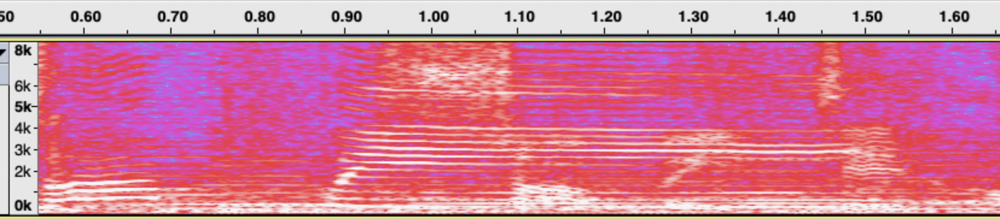

DFT是离散傅里叶变换，是一种适合计算机实现的傅里叶变换形式。这个仓库的目标是学习如何实现DFT，并逐步优化。在开始学习怎么使用代码实现DFT之前，我们需要快速理解傅里叶变换和离散傅里叶变换的背景知识。

# 什么是傅里叶变换?

人类对物理世界的信号进行观察、测量，最直接的方式，是记录信号随着时间的变化。这就得到时域信号x(t)，表示时间方向的信号幅度。对信号进行时域分析，有很多数学工具。但是信号的一些特征，可能是非时变的、在时域上并不能直接感知的，数学家/物理学家会将信号转到某种变换域上去分析。

比如，在一场音乐会上录制的音频，有男低音的歌声、女高音的歌声、各种乐器或高或低的演奏声。音频信号在时域上，看起来像是杂乱无章变化的序列，只能看到有时候音量高，有时候音量低。我们如何分辨里面哪些声音是男低音、哪些是女高音、哪些是乐器、各自表演的歌曲是什么？


我们知道，声波是一种振动，其特征就是两个量：振动频率和振动幅度。振动频率越高的声音，人耳的感受更尖锐，振动频率越低，人耳感受越低沉。成人男性的声带一般较女性的声带更粗更宽，声带震动慢，因此一般男声更低沉、女声更高亢。而不同的乐器有不同的共振频率和谐波，比如琴弦越短，声音越高。如果我们把音乐的声波信号包含了哪些振动频率找出来，我们就能分析这首音乐包含了哪些乐器和演唱者、是在演奏什么歌曲了。如下图。



傅里叶变换就是这样一种数学工具，可以将信号变换到频域上，进行频率分析。通过傅里叶变换，我们将时域中的（幅度，时间）变换到频域中的（幅度，频率）进行分析和处理。知乎的

这个变换是怎么实现的呢？我们回头看上面的音乐信号，将其中一段放大，可以看到一些相似波形在重复出现，而大波形里又叠加了一些小波形。看起来杂乱无章变化的时域序列，并不是真的杂乱无章，其实可以分解为不同周期信号的叠加。周期越长，就是频率越低，周期越短，就是频率越高。


将一个时域信号，分解为不同频率的周期信号的线性叠加，这就是傅里叶变换的基础出发点。

## 连续时间傅里叶级数FS


$$\begin{aligned}
X(kf_0) & = \frac{1}{T_0}\int_{T0} x(t) e^{-2\pi kf_0t}dt \\
x(t) & = \sum_{k=-\infty}^{\infty} X(kf_0)e^{2\pi kf_0t} 
\end{aligned}$$

## 连续时间傅里叶变换CTFT

对于非周期信号，可以认为其周期趋近于无穷，

$$\begin{aligned}
X(f) & = \int_{t=-\infty}^{\infty} x(t) e^{-2\pi ft}dt \\
x(t) & = \int_{k=-\infty}^{\infty} X(f)e^{2\pi ft}df 
\end{aligned}$$

# 什么是DFT?
针对物理世界的连续信号，我们有连续时间傅立叶变换作为数学工具。但是电子计算机使用二进制器件进行计算、且只有固定的内存空间，故只能处理数字化的信号，也就是有限长的、离散化的、量化的信号。

而离散傅立叶变换（DFT）就是为数字世界设计的，一种时域信号离散且有限长、频域信号离散且有限长的变换。


离散时间傅里叶变换DTFT

$$\begin{aligned}
X(f) & = T_s\sum_{k=-\infty}^{\infty} x(nTs) e^{-2\pi f(nTs)} \\
x(nTs) & = \int_{f_s} X(f)e^{2\pi f(nTs)}df 
\end{aligned}$$

离散傅里叶变换DFT

$$\begin{aligned}
DFT: X[k] & = \sum_{n=0}^{N-1} x[n] e^{-2\pi \frac{k}{N}n} \\
IDFT: x[n] & = \frac{1}{N}\sum_{n=0}^{N-1} X[k] e^{2\pi \frac{k}{N}n} 
\end{aligned}$$

|变换 |	时间	|频率|
|:-----:|  :----: | :----:| 
|连续傅里叶变换|	连续，非周期性	|连续，非周期性|
|傅里叶级数|	连续，周期性	|离散，非周期性|
|离散时间傅里叶变换	|离散，非周期性	|连续，周期性|
|离散傅里叶变换	|离散，周期性|	离散，周期性|

有了DFT，我们就可以对现实世界的信号进行频率分析啦，而且可以使用数学或软件的手段进行计算加速，成为一种高效的数字信号处理工具。从而衍生出各式各样的数字信号处理的应用，DSP应用主要是围绕这三个阶段：
- Analysis 分析：从时域到频域的信号变换，如语音到语谱。
- Filtering 滤波：频域上的操作，如高通、低通、均衡。
- Synthesis 合成：从频域到时域的逆变换，如从语谱合成语音。

# DFT的代码实现
DFT变换和逆变换的公式如下

$$\begin{aligned}
DFT: X[k] & = \sum_{n=0}^{N-1} x[n] e^{-2\pi \frac{k}{N}n} \\
IDFT: x[n] & = \frac{1}{N}\sum_{n=0}^{N-1} X[k] e^{2\pi \frac{k}{N}n} 
\end{aligned}$$

其中时域信号$x[n]$和频域信号$X[k]$都是复数信号。因为计算机的算数运算都是实数运算，复数运算需要额外的库支持，所以我们可以将DFT公式展开成实数运算。首先使用欧拉公式展开复指数：

$$\begin{aligned}
X[k] & = \sum_{n=0}^{N-1} x[n] e^{-2\pi \frac{k}{N}n} \\
     & = \sum_{n=0}^{N-1} x[n] \left[ \cos(2\pi \frac{k}{N}n) - j\sin(2\pi \frac{k}{N}n)\right] \\
     & = \sum_{n=0}^{N-1} \left( x_r[n] + jx_i[n]\right) \left[ \cos(2\pi \frac{k}{N}n) - j\sin(2\pi \frac{k}{N}n)\right] 
\end{aligned}$$

然后分解实部和虚部，我们就得到了DFT和IDFT实部和虚部计算的四条公式：

$$\begin{aligned}
X_r[k] & = \sum_{n=0}^{N-1} \left[ x_r[n]\cos(2\pi \frac{k}{N}n) + x_i[n]\sin(2\pi \frac{k}{N}n)\right] \\
X_i[k] & = \sum_{n=0}^{N-1} \left[-x_r[n]\sin(2\pi \frac{k}{N}n) + x_i[n]\cos(2\pi \frac{k}{N}n)\right] \\
\end{aligned}$$

$$\begin{aligned}
x_r[n] & = \frac{1}{N}\sum_{n=0}^{N-1} \left[ X_r[k]\cos(2\pi \frac{k}{N}n) - X_r[k]\sin(2\pi \frac{k}{N}n)\right] \\
x_i[n] & = \frac{1}{N}\sum_{n=0}^{N-1} \left[X_r[k]\sin(2\pi \frac{k}{N}n) + X_r[k]\cos(2\pi \frac{k}{N}n)\right] \\
\end{aligned}$$

为了减少每次进行DF计算的时间，我们可以使用空间换时间。在DFT类初始化时，给定DFT的size，并且预创建三角函数表 $t\_cos[k][n] = \cos(2\pi \frac{k}{N}n)$ 和 $t\_sin[k][n] = \sin(2\pi \frac{k}{N}n)$, 后续每次计算DFT时查表即可。

```cpp
    for (int i = 0; i < m_size; ++i)
    {
        for (int j = 0; j < m_size; ++j)
        {
            double arg = (double(i) * double(j) * M_PI * 2.0) / m_size;
            m_sin[i][j] = sin(arg);
            m_cos[i][j] = cos(arg);
        }
    }
```
最后，我们通过下面四条公式即可实现基础的DFT变化和逆变换。

$$\begin{aligned}
X_r[k] & = \sum_{n=0}^{N-1} \left( x_r[n]*t\_cos[k][n] + x_i[n]*t\_sin[k][n]\right) \\
X_i[k] & = \sum_{n=0}^{N-1} \left(-x_r[n]*t\_sin[k][n] + x_i[n]*t\_cos[k][n]\right) \\
x_r[n] & = \frac{1}{N}\sum_{n=0}^{N-1} \left( X_r[k]*t\_cos[k][n] - X_i[k]*t\_sin[k][n]\right) \\
x_i[n] & = \frac{1}{N}\sum_{n=0}^{N-1} \left(X_r[k]*t\_sin[k][n] + X_i[k]*t\_cos[k][n]\right) \\
\end{aligned}$$

```cpp
void DFT::Forward(const double* real_in, const double* imag_in, double* real_out, double* imag_out) {
    for (int i = 0; i < m_size; ++i) {
        double re = 0.0, im = 0.0;
        for (int j = 0; j < m_size; ++j) re += real_in[j] * m_cos[i][j] + imag_in[j] * m_sin[i][j];
        for (int j = 0; j < m_size; ++j) im -= real_in[j] * m_sin[i][j] - imag_in[j] * m_cos[i][j];
    }
}

void DFT::Inverse(const double* real_in, const double* imag_in, double* real_out, double* imag_out) {
    for (int i = 0; i < m_size; ++i) {
        double re = 0.0, im = 0.0;
        for (int j = 0; j < m_size; ++j) re += real_in[j] * m_cos[i][j] - imag_in[j] * m_sin[i][j];
        for (int j = 0; j < m_size; ++j) im += real_in[j] * m_sin[i][j] + imag_in[j] * m_cos[i][j];
    }
}
```
# 实数序列DFT
现实世界采集的信号通常是实数序列，其虚部为零，所以虚部乘法全部可以去掉。

这就是实数序列DFT的共轭对称性

有了这个性质，对于实数序列DFT, 我们不仅节约了大半计算耗时，还节省接近一半存储空间。

```cpp
    void DFT::ForwardReal(const double* real_in, double* real_out, double* imag_out)
    {
        for (int i = 0; i < m_size / 2 + 1; ++i)
        {
            double re = 0.0, im = 0.0;
            for (int j = 0; j < m_size; ++j)
                re += real_in[j] * m_cos[i][j];
            for (int j = 0; j < m_size; ++j)
                im -= real_in[j] * m_sin[i][j];
            real_out[i] = re;
            imag_out[i] = im;
        }
    }
```

# DFT性能测试


```cpp
    start_time = clock();
    my_dft.Forward(in_real, in_imag, out_real, out_imag);
    end_time = clock();

```
```cpp
    start_time = clock();
    kiss_fft(forward_fft, in_cpx, out_cpx);
    end_time = clock();
```

```cpp
    start_time = clock();
    my_dft.ForwardReal(in_real, out_real, out_imag);
    end_time = clock();
 ```

```cpp
    start_time = clock();
    kiss_fftr(forward_fft, in_real, out_cpx);
    end_time = clock();
```

1024点double类型DFT性能测试
|        | KissFFT |  DFT  | KissFFTR| DFT Real |
| :-----:|  :----: | :----:| :----: | :----: |
| Time Per Pass   | 0.01055ms | 2.39988ms | 0.00657ms |  1.0395ms |
| Forward-Inverse Error |  1.208e-16  | 5.267e-14 | 1.213e-16 | 3.368e-14 |
| DFT-KissFFT Differene |    | 1.196e-12 |  | 2.122e-13 |

到这里，我们就使用C++实现了一个基础的DFT，可以在程序中实际运行且验证了计算的正确性。但是其计算复杂度是$O(log N^2)$,计算性能离可商用距离还比较遥远。

因此，我们需要引入DFT的计算优化，也就是下一步要讨论的快速傅里叶变换（FFT）。

# 参考资料
- Proakis, John G. Digital signal processing: principles algorithms and applications. Pearson Education India, 2001.
- [Mathematics of the Discrete Fourier Transform (DFT), with Audio Applications --- Second Edition, by Julius O. Smith III, W3K Publishing, 2007](https://ccrma.stanford.edu/~jos/mdft/mdft.html)
- [從傅立葉轉換到數位訊號處理](https://alan23273850.gitbook.io/signals-and-systems)
- [KISSFFT, by Mark Borgerding](https://github.com/mborgerding/kissfft)