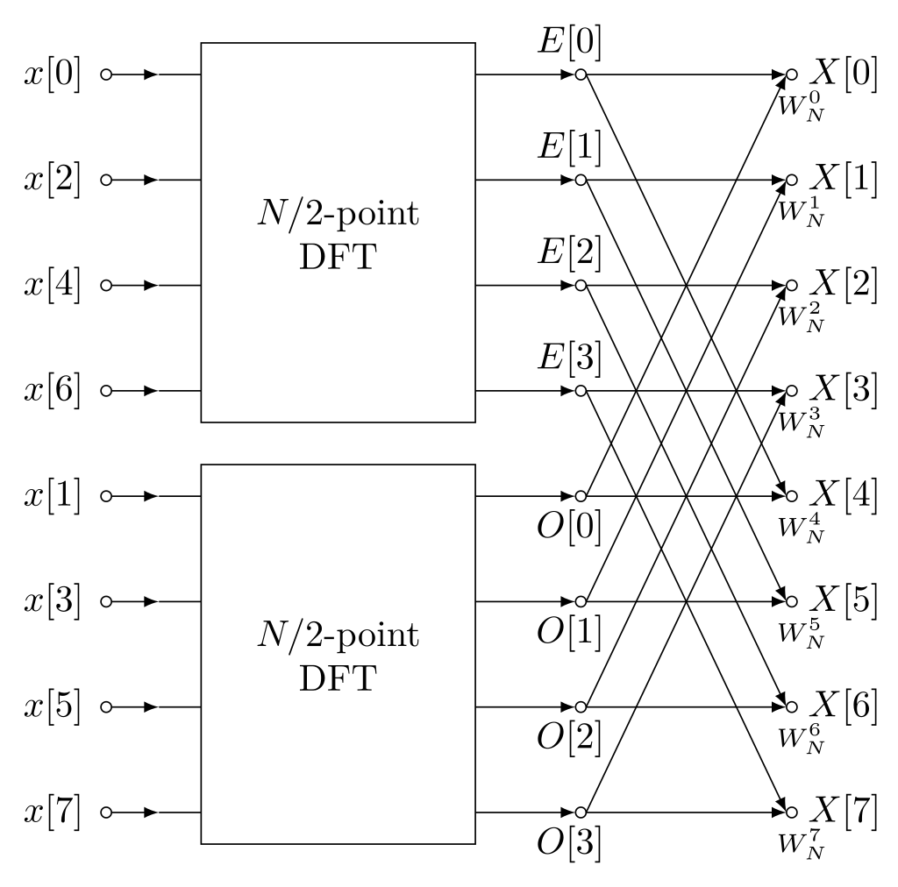
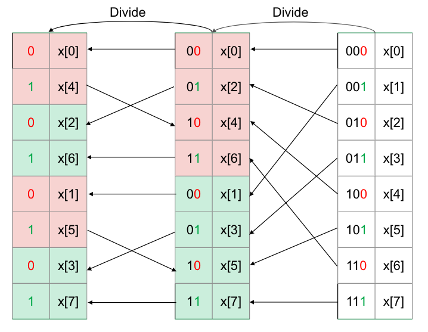
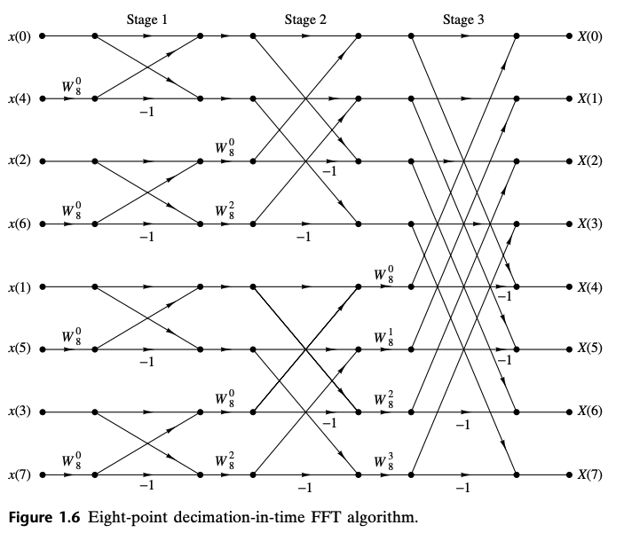

从[DFT的实现](DFT_cn.md)可知其时间复杂度是 $O(N^2)$ 。这个实现的计算量很大，给工程落地带来很大的障碍。

这一节，我们介绍DFT的快速实现：快速傅立叶变换（FFT）。FFT的实现方式有很多种，我们首先学习最经典的一种情况：对长度N为2的幂次方的序列，时间上按基2分解的Cooley–Tukey算法，这种FFT的实现计算量降到了 $O(N\log N)$

# 用分治策略计算DFT

首先，DFT的公式如下:

$$\begin{aligned}
DFT: X[k] & = \sum_{n=0}^{N-1} x[n] e^{-j2\pi \frac{k}{N}n}, for\ k = 0,1,..., N-1 \\
IDFT: x[n] & = \frac{1}{N}\sum_{n=0}^{N-1} X[k] e^{j2\pi \frac{k}{N}n} ,for\ n = 0,1,..., N-1 
\end{aligned}$$

若n和k的长度N是偶数，则可以将DFT的偶数点和奇数点分开计算，原长度为N的序列被分解成两个长度为M=N/2的子序列 $x_e$ 和 $x_o$。

$$\begin{aligned}
X[k] & = \sum_{n=0}^{N-1} x[n] e^{-j2\pi \frac{k}{N}n} \\
      & = \sum_{m=0}^{N/2-1} x[2m] e^{-j2\pi \frac{k}{N}2m}  + \sum_{m=0}^{N/2-1} x[2m+1] e^{-j2\pi \frac{k}{N}2m+1} \\
      & = \sum_{m=0}^{N/2-1} x[2m] e^{-j2\pi \frac{k}{N/2}m}  + e^{-j2\pi \frac{k}{N}}\sum_{m=0}^{N/2-1} x[2m+1] e^{-j2\pi \frac{k}{N/2}m} \\
      & = \sum_{m=0}^{M-1} x_e[m] e^{-j2\pi \frac{k}{M}m}  + e^{-j2\pi \frac{k}{N}}\sum_{m=0}^{M-1} x_o[m] e^{-j2\pi \frac{k}{M}m} 
\end{aligned}$$

把k也分成两部分，第一部分是k=0~N/2-1, 第二部分是k=N/2～N-1。首先看前一部分，DFT实际就被分解成了两个长度为M=N/2的子傅立叶变换 $X_e[k]$ 和 $X_o[k]$。 

$$\begin{aligned}
X[k] & = \sum_{m=0}^{M-1} x_e[m] e^{-j2\pi \frac{k}{M}m}  + e^{-j2\pi \frac{k}{2M}}\sum_{m=0}^{M-1} x_o[m] e^{-j2\pi \frac{k}{M}m} \\
& = X_e[k] + e^{-j2\pi \frac{k}{N}}X_o[k],\  for\ k =0,...N/2-1\\
\end{aligned}$$

对于第二部分，我们把下标写作 k + M, 其中 k=0~N/2-1.

$$\begin{aligned} 
X[k+M] & = X_e[k+M] + e^{-j2\pi \frac{k + M}{2M}}X_o[k+M],\  for\ k =0,...N/2-1\\
& = X_e[k+M] + e^{-j\pi} e^{-j2\pi \frac{k}{2M}}X_o[k+M]\\
& = X_e[k+M] - e^{-j2\pi \frac{k}{N}}X_o[k+M]\\
\end{aligned}$$

DFT时域和频域上，均具有周期性

$$\begin{aligned} 
X_e[k+M] & = X_e[k] \\
X_o[k+M] & = X_o[k] \\
\end{aligned}$$

于是，k=0~N/2-1的DFT结果就是：

$$\begin{aligned} 
X[k+M] & = X_e[k] - e^{-j2\pi \frac{k}{N}}X_o[k],\  for\ k =0,...N/2-1\\
\end{aligned}$$

综上，长度为偶数的DFT可以用分治发计算，就是分解成奇序列和偶序列的子DFT的加权和。其中系数 $e^{-j2\pi \frac{k}{N}}$ 被称为旋转因子，也记作 $W^k_N$ 。

$$\begin{aligned}
X[k] & = X_e[k] + e^{-j2\pi \frac{k}{N}}X_o[k] \\
X[k + \frac{N}{2}] & = X_e[k]- e^{-j2\pi \frac{k}{N}}X_o[k] \\
\end{aligned}$$

长度为N的DFT = 两个长度为N/2的DFT + N次乘法 + N次加法。 分治之后的计算杂度为

$$\begin{aligned}
T(N) = 2T(\frac{N}{2}) + O(n)
\end{aligned}$$

# FFT的递归实现

如果长度N是2的幂次方，则每次分解成一半长度的DFT后，都可以按照一下步骤继续分解：

- 按下标为偶数还是奇数，将序列分解成两个半长度子序列. 
- 计算两个子序列的DFT
- 将奇序列的DFT乘上旋转因子
- 偶序列的DFT与旋转后的奇序列的DFT相加，得到前一半DFT
- 偶序列的DFT与旋转后的奇序列的DFT相减，得到后一半DFT
- 一直分解到只有一个点 $X[0] = x[0]$ 。



*[Source: DIT-FFT-butterfly.svg By Yangwenbo99 - Own work, CC BY-SA 4.0](https://commons.wikimedia.org/w/index.php?curid=111271197)*

按照以上思想，很容易写出递归的基2FFT实现。首先写一个分解奇偶元素的函数。

```cpp
    template <typename T>
    void DeInterleave(const int len, T* data)
    {
        int half_len = len / 2;
        vector<T> tmp(half_len);
        for (int i = 0; i < half_len; i++)
        {
            data[i] = data[i * 2];
            tmp[i] = data[i * 2 + 1];
        }
        for (int i = 0; i < half_len; i++)
        {
            data[i + half_len] = tmp[i];
        }
    }
```

然后写一个FFT递归核心函数。

```cpp
    void FFTRadix2Recursive(const int len, double* real_in, double* imag_in, 
                          double* real_out,double* imag_out, bool forward)
    {
        int f_sign = forward ? 1 : -1;
        if (len == 1)
        {
            real_out[0] = real_in[0];
            imag_out[0] = imag_in[0];
        }
        else
        {
            int half_len = len / 2;
            int m = m_size / len;
            DeInterleave(len, real_in);
            DeInterleave(len, imag_in);
            double* even_in_real = real_in;
            double* even_in_imag = imag_in;
            double* odd_in_real = real_in + half_len;
            double* odd_in_imag = imag_in + half_len;
            double* even_out_real = real_out;
            double* even_out_imag = imag_out;
            double* odd_out_real = real_out + half_len;
            double* odd_out_imag = imag_out + half_len;

            FFTRadix2Recursive(half_len, even_in_real, even_in_imag, even_out_real, even_out_imag,
                             forward);
            FFTRadix2Recursive(half_len, odd_in_real, odd_in_imag, odd_out_real, odd_out_imag,
                             forward);
            for (int k = 0; k < half_len; ++k)
            {
                double odd_twiddle_real =
                    T(odd_out_real[k] * m_cos[k][m] + f_sign * odd_out_imag[k] * m_sin[k][m]);
                double odd_twiddle_imag =
                    T(odd_out_imag[k] * m_cos[k][m] - f_sign * odd_out_real[k] * m_sin[k][m]);

                real_out[k + half_len] = even_out_real[k] - odd_twiddle_real;
                imag_out[k + half_len] = even_out_imag[k] - odd_twiddle_imag;
                real_out[k] = even_out_real[k] + odd_twiddle_real;
                imag_out[k] = even_out_imag[k] + odd_twiddle_imag;
            }
        }
    }
```

# FFT的非递归实现

递归的调用总归是要消耗额外资源的，在追求性能的场景，递归实现一般会改造成迭代方式实现。

我们首先分析一下上面的FFTCoreRecursive()函数，每次调用都包括“分”与”合“两个步骤。

分：就是将每次的输入序列，分成偶序列和奇序列。



```cpp
static void GenBitReverseOrder(size_t len, std::vector<size_t>& arr)
{
    for (size_t i = 0; i < len; i++)
    {
        arr[i] = 0;
        size_t idx = i;
        size_t step = len / 2;
        while (idx > 0)
        {
            if (idx % 2 == 1)
                arr[i] += step;
            idx /= 2;
            step /= 2;
        }
    }
}
    
GenBitReverseOrder(m_size, m_bit_reverse_idx);
```

合：就是偶序列的FFT，与奇序列的FFT乘旋转因子后结果求和。


*[Source: ‘Digital Signal Processing Principles, Algorithms and Applications’ by J.G. Proakis and D.G. Manolakis]()*

```cpp
    void FFTRadix2::FFTRadix2Core(double* real_out, double* imag_out, bool forward)
    {
        int f_sign = forward ? 1 : -1;
        for (int btfly = 2, step = 1; btfly <= m_size; btfly *= 2, step *= 2)
        {
            int m = m_size / btfly;
            for (int i = 0; i < m_size; i += btfly)
            {
                for (int k = 0; k < step; ++k)
                {
                    int even = i + k;
                    int odd = even + step;

                    double odd_twiddle_real =
                        T(real_out[odd] * m_cos[k][m] + f_sign * imag_out[odd] * m_sin[k][m]);
                    double odd_twiddle_imag =
                        T(imag_out[odd] * m_cos[k][m] - f_sign * real_out[odd] * m_sin[k][m]);

                    real_out[odd] = real_out[even] - odd_twiddle_real;
                    imag_out[odd] = imag_out[even] - odd_twiddle_imag;
                    real_out[even] = real_out[even] + odd_twiddle_real;
                    imag_out[even] = imag_out[even] + odd_twiddle_imag;
                }
            }
        }
    }
```

所以，基2-FFT的流程，就是先把序列按逆位序重排，然后迭代进行蝶形运算。

```cpp
    void FFTRadix2::Forward(const double* real_in, const double* imag_in, double* real_out, double* imag_out)
    {
        for (int i = 0; i < m_size; ++i)
        {
            real_out[i] = real_in[m_bit_reverse_idx[i]];
            imag_out[i] = imag_in[m_bit_reverse_idx[i]];
        }
        FFTRadix2Core(real_out, imag_out, true);
    }
```

FFTRadix2Core()里面，一共迭代 $log2(N)$ 级，每一级有N/2组蝶形运算，所以FFT的计算复杂度在 $O(Nlog(N))$ 级别。

# FFT性能测试

以1024点double类型随机数作输入，在一台CPU是2.3Ghz Intel Core i9的Macbook pro上测试结果如下：

|        | KissFFT |  my DFT  | FFTRadix2 Recursive | FFTRadix2 Iterative|
| :-----:|  :----: | :----:| :----: | :----: |
| Time Per Pass   | 0.01055ms | 2.39988ms | 0.04155ms |  0.02181ms |
| Forward-Inverse Error |  1.208e-16  | 5.267e-14 | 1.279e-16 | 1.279e-16 |
| DFT-KissFFT Differene |    | 1.196e-12 |  2.235e-15 | 2.235e-15 |


以1024点float类型随机数作输入，在一台CPU是2.3Ghz Intel Core i9的Macbook pro上测试结果如下：

|        | KissFFT |  PFFFT |my DFT  | FFTRadix2 Recursive | FFTRadix2 Iterative|
| :-----:|  :----: | :----: | :----:| :----: | :----: |
| Time Per Pass   | 0.01066ms |  0.00454ms |2.39988ms | 0.04155ms |  0.02039ms |
| Forward-Inverse Error |  6.0613e-08  | 6.281e-08  | 6.26189e-08 | 6.262e-08 | 6.262e-08 |
| DFT-KissFFT Differene |    | 1.145e-06 | 1.196e-12 |  8.512e-07 | 8.512e-07|

# 参考资料
- [Cooley–Tukey FFT algorithm](https://en.wikipedia.org/wiki/Cooley%E2%80%93Tukey_FFT_algorithm)
- Proakis, John G. Digital signal processing: principles algorithms and applications. Pearson Education India, 2001.
- [Mathematics of the Discrete Fourier Transform (DFT), with Audio Applications --- Second Edition, by Julius O. Smith III, W3K Publishing, 2007](https://ccrma.stanford.edu/~jos/mdft/mdft.html)
- [從傅立葉轉換到數位訊號處理](https://alan23273850.gitbook.io/signals-and-systems)
- [KISSFFT, by Mark Borgerding](https://github.com/mborgerding/kissfft)
- [PFFFT: a pretty fast FFT](https://bitbucket.org/jpommier/pffft/src/master/)